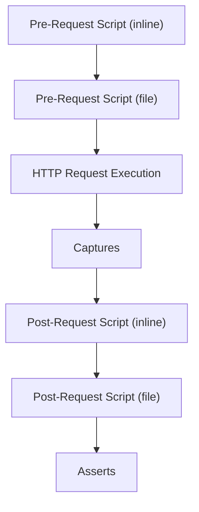

{: .fs-10 .fw-300 }
# Requests

{: .fs-6 .fw-300 }
The request describes a single HTTP request exection.

## Syntax

```yml
kind: request # required; defines the document as a request
name: Cat Breeds # optional; used to identify this request
path: https://catfact.ninja/breeds # required; the request URL
verb: GET # optional; HTTP request method
timeoutSeconds: 0 # optional; execution timeout
headers: # optional; HTTP request headers
  Accept: application/json # optional; example of a header
body: | # optional; HTTP request body
  {
    "myvar": "myval"
  }
graphql: # optional; send as GraphQL query
  query: | # required; a GraphQL query
    {
      ...
    }
  variables: # optional; key/value GraphQL variables
    myvar: myval # optional; example of a GraphQL variable
preRequestScript: | # optional; Javascript to run prior to the request
  console.log("Hello, World!");
preRequestScriptFile: ./hello-world.js # optional; script file to run prior to the request
postRequestScript: | # optional; Javascript to run after the request
  console.log("Good-bye, World!");
postRequestScriptFile: ./good-bye-world.js # optional; script file to run after the request
captures: # optional; variables to capture from the HTTP response
  myVar: jsonpath $.myVar # optional; example variable capture
asserts: # optional; asserts to validate from the HTTP response
  - status == 200 # optional; example HTTP OK response status assert
```

## Order of Operations

The request life-cycle is performed as follows:



## Properties

### `kind` - Kind

`string`. Required. Allowed values: `request`.

Defines the document type as a request.

### `name` - Name

`string` Optional.

A name used to identify the request. This is used in any logs/output to refer to the request. If a name isn't given, its file-name is used instead.

### `path` - Execution path

Alias: `url`. `string`. Required.

The url to execute. Query parameters may also be included in the path.

### `verb` - HTTP verb

Alias: `method`. `string`. Optional. Allowed values: `GET`, `HEAD`, `POST`, `PUT`, `DELETE`, `CONNECT`, `OPTIONS`, `TRACE`, `PATCH`. Default value: `GET`.

Sets the method on the HTTP request. 

### `timeoutSeconds` - Timeout in seconds

`integer`. Optional. Default value: `0`.

Execution timeout for the request. If the request exceeds this timeout it will be canceled and considered a failure. A value of `0` indicates no timeout should be set.

### `headers` - HTTP request headers

`object`. Optional.

A set of HTTP request headers to include. Any number of headers may be included as YAML properties.

### `body` - HTTP request body

`string | object`. Optional.

Sets the HTTP request body to the given value. For most values of `headers["Content-Type"]`, simply set the body to the string representation. For example, when using `application/json`, the body should look like this:

```yml
body: |
  {
    "someField": "someValue"
  }
```

To use a file for the body content, set the body to the relative path and prefix it with the `@` character, e.g.:

```yml
body: "@payload.json"
```

If `headers["Content-Type"]` is `multipart/form-data`, then form data should be defined as key/value pairs, e.g.:

```yml
body:
  someField: someValue # fields are added inline
  someFile:  "@file.txt" # attachments may be added by their relative path and are prefixed with @ 
```

### `graphql` - GraphQL data

`object`. Optional.

If present, defines the request as a GraphQL request, which sets the `verb` to `POST` and `headers["Content-Type"]` to `application/json`.

### `graphql.query` - GraphQL Query

`string`. Required.

Sets the query in the GraphQL payload. Accepts either an inline query or a file-path via the `@` prefix.

### `graphql.variables` - GraphQL Variables

`object`. Optional.

Sets the variables in the GraphQL payload. Any number of variables may be included as YAML properties.

### `preRequestScript` - Pre-request script

`string`. Optional.

Defines an inline script to run prior to the request.

### `preRequestScriptFile` - Pre-request script file

`string`. Optional.

Defines an relative path to a script to run prior to the request.

### `postRequestScript` - Post-request script

`string`. Optional.

Defines an inline script to run after the request.

### `postRequestScriptFile` - Post-request script file

`string`. Optional.

Defines an relative path to a script to run after the request.

### `captures` - Variable Captures

`object`. Optional.

A set of captures to perform. Any number of variables may be captured as YAML keys.

{: .highlight }
For the full capture reference, see [Concepts -> Captures](/reference/concepts/captures).

### `asserts` - Asserts

`string[]`. Optional.

Defines the asserts to perform. Any number of asserts may be specified.

{: .highlight }
For the full assert reference, see [Concepts -> Asserts](/reference/concepts/asserts).